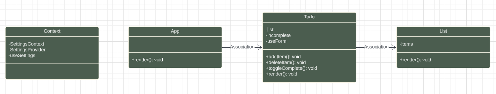

# To Do List Manager

**Author**: Wajiha Khan

**Version** 1.0.0

## Phase One

**Global State Management**
The application utilizes React Context API to manage global state. The `SettingsContext` provides default settings such as the number of items per page, hiding completed items, and the default sort word. These settings are made available to all components through the `SettingsProvider`.

**useForm Hook**
The `useForm` hook manages form state and handles form submissions. It initializes form values, updates them on input change, and triggers a callback function upon form submission. This hook simplifies form management and ensures consistent state handling across the application.

